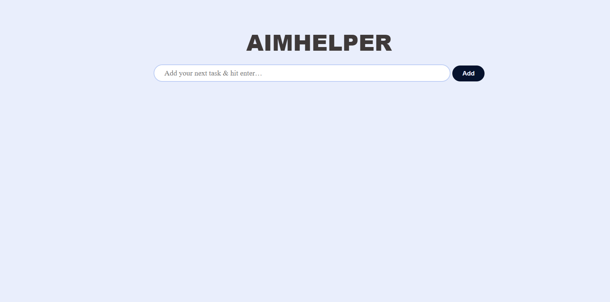
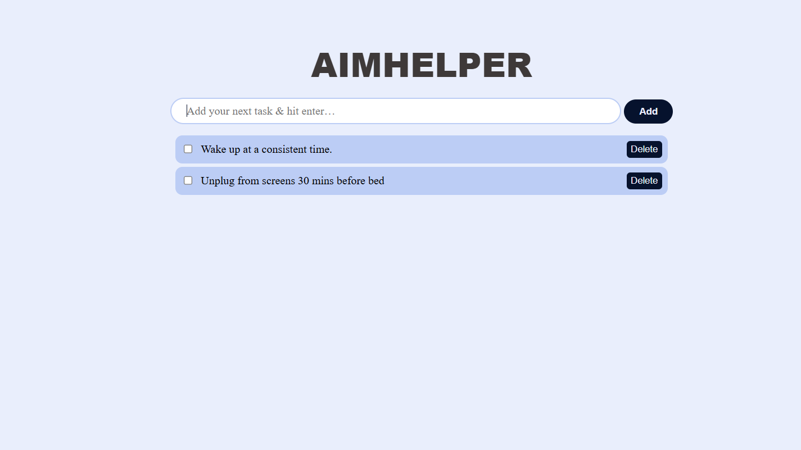
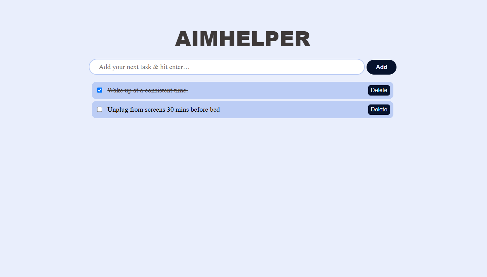
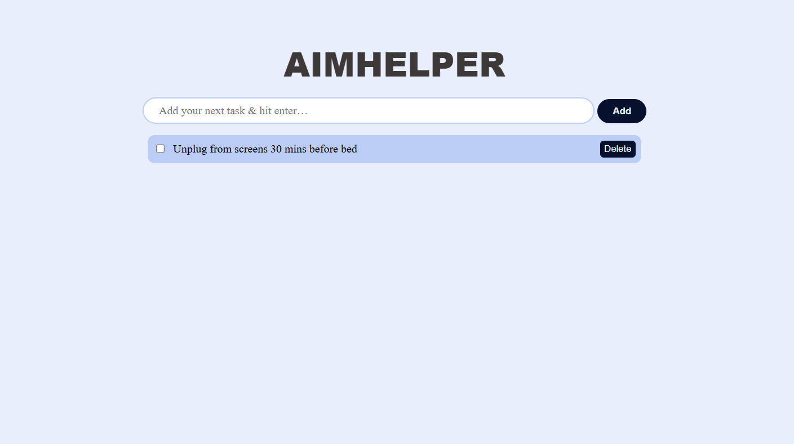

# AimHelper

##Overview of project

AimHelper is a task management website I developed using **JavaScript, CSS, and HTML** in order to improve organizational efficiency. The visually appealing and simple user interface allows for easy-to-track tasks!

### Home Page

### Add Items

### Check Off Items

### Delete Items

